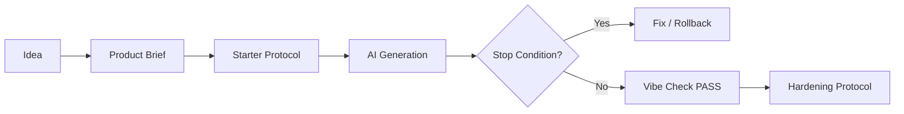
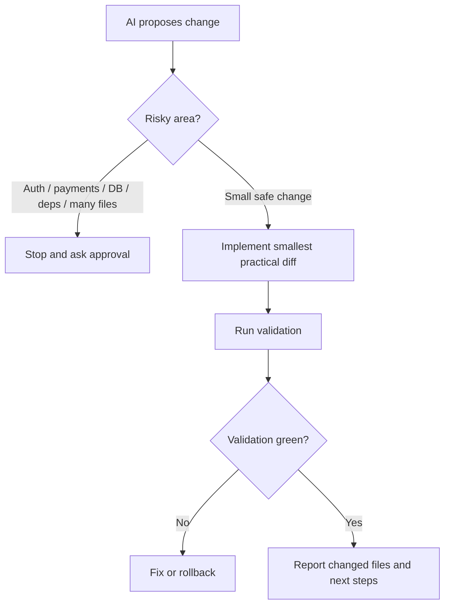

# Vibe Coding Protocols

### Project status

[](./CHANGELOG.md)
[](https://anmalishev.ru/expert/vibe-coding/)
[](./LICENSE)
[](./CHANGELOG.md)
[](https://anmalishev.ru/)
[](https://github.com/Gudvin82/vibe-coding-protocols)

### AI IDE ready

[](./CLAUDE.md)
[](./AGENTS.md)
[](./.cursorrules)
[](./.windsurfrules)
[](./.github/copilot-instructions.md)

### CI

[](https://github.com/Gudvin82/vibe-coding-protocols/actions/workflows/toolkit-smoke.yml)
[](https://github.com/Gudvin82/vibe-coding-protocols/actions/workflows/link-check.yml)
[](https://github.com/Gudvin82/vibe-coding-protocols/actions/workflows/vibe-check.yml)

**An agent harness and operating layer for AI-assisted delivery — not just a prompt collection.**

**Practical protocols, prompts, checklists and markdown templates for safer AI-assisted / vibe coding projects.**

Vibe Coding Protocols helps founders, solo builders and teams turn AI-assisted coding into a controlled delivery workflow: Product Brief, Memory Bank, AI IDE rules, Starter, Hardening, vibe-check, security operations, model routing and audit backlog.

Repository package: `v0.1.7`  
Web methodology: `Vibe Coding Protocols v1.4`

Languages:
- English: [README_en.md](./README_en.md)
- Русский: [README_ru.md](./README_ru.md)
- Decision wizard: [START_HERE.md](./START_HERE.md)

## Start here

| I have... | Start here | Copy first | Run |
|---|---|---|---|
| Only an idea | Product Brief | `prompts/product-brief-prompt.md` | — |
| New AI project | Starter Protocol | `AGENTS.md` + `templates/PROJECT_MAP.md` | `bash scripts/vibe-check.sh --starter` |
| Existing AI-generated code | Hardening Protocol | `templates/AUDIT_BACKLOG.md` | `bash scripts/vibe-check.sh --hardening` |
| Public / production project | Extended path | `SECURITY_OPERATIONS_BASELINE.md` + perimeter checklist | `bash scripts/vibe-check.sh --audit` |
| I want AI to apply this repo | AI entry prompt | `prompts/use-this-repo-prompt.md` | — |

Need a route chooser with a little more context?
- [START_HERE.md](./START_HERE.md)

## Start in 2 minutes

### New project

1. Copy `AGENTS.md` into your repo.
2. Copy `templates/PROJECT_MAP.md`.
3. Open `prompts/product-brief-prompt.md`.
4. Paste the Product Brief prompt into your AI IDE.
5. Run:

```bash
bash scripts/vibe-check.sh --starter
```

### Existing AI-generated project

1. Copy `templates/AUDIT_BACKLOG.md`.
2. Open `protocols/ai-project-hardening-protocol.md`.
3. Run:

```bash
bash scripts/vibe-check.sh --hardening
```

### Review-first minimal setup

Recommended flow:

```bash
curl -fsSL https://raw.githubusercontent.com/Gudvin82/vibe-coding-protocols/main/scripts/init-minimal.sh -o init-minimal.sh
less init-minimal.sh
bash init-minimal.sh --starter
```

Fast track for empty repositories. Review-first flow above is recommended.

```bash
curl -fsSL https://raw.githubusercontent.com/Gudvin82/vibe-coding-protocols/main/scripts/init-minimal.sh | bash -s -- --starter
```

Optional local guardrail:

```bash
bash scripts/install-hooks.sh
```

## 10-second overview

1. **Start** — turn an idea into a Product Brief and first safe vertical slice.
2. **Build** — use `AGENTS.md`, `PROJECT_MAP.md` and AI IDE rules to keep scope controlled.
3. **Harden** — audit AI-generated code before merge, deploy or production.
4. **Reuse** — copy markdown templates, prompts and checklists into your project.

## Agent harness

This repository is an agent harness for AI-assisted delivery.

It combines:
- Memory Bank files;
- AI IDE rules;
- model routing;
- token-aware discovery;
- stop conditions;
- validation checks;
- security baselines;
- review loops;
- backlog and release handoff.

See:
- [docs/agent-harness.md](./docs/agent-harness.md)
- [docs/model-routing.md](./docs/model-routing.md)
- [commands/README.md](./commands/README.md)
- [docs/auth-session-security.md](./docs/auth-session-security.md)
- [checklists/auth-abuse-checklist.md](./checklists/auth-abuse-checklist.md)

## Commands

Reusable AI command patterns live in [commands/](./commands/README.md).
They are copyable instructions for AI IDEs, not executable shell commands.

## Why this exists

AI IDEs can generate code quickly, but projects often fail because context,
architecture, security, dependencies, tests, deployment and ownership are not controlled.

Vibe Coding Protocols adds an operating layer around AI-assisted development:
- Product Brief before code;
- active / deferred surfaces;
- Memory Bank files;
- AI IDE rules;
- Starter workflow;
- Hardening workflow;
- audit backlog;
- self-protection and perimeter checks;
- safe third-party intake;
- token-aware code discovery;
- validation and review gates.

## What problem does it solve?

Common AI-generated project problems:
- AI starts coding before the product is clear;
- generated code spreads across too many files;
- dependencies are added without review;
- architecture exists only in chat history;
- security checks happen too late;
- secrets, logs or internal docs become public;
- external APIs, repos and packages are trusted too quickly;
- the project cannot scale after the first users;
- AI burns tokens reading the whole repository;
- nobody knows whether the project is ready for merge or deploy.

This toolkit turns those risks into checklists, prompts, templates and lightweight automation.

## Give this repository to your AI

Use [prompts/use-this-repo-prompt.md](./prompts/use-this-repo-prompt.md)
when you want an AI IDE to inspect this toolkit first, choose the right route,
list the first files to copy and point out underestimated risks before writing code.

## Paste this into your AI IDE

```text
Study this repository:
https://github.com/Gudvin82/vibe-coding-protocols

Do not write code yet.

First tell me:
1. Which route fits my project: Starter, Hardening, Templates, Architecture Source of Truth, or Security Operations?
2. Which files I should copy first.
3. Which questions are missing.
4. Which risks I may be underestimating.
5. What is the smallest safe next step?

If you cannot open GitHub links, ask me to paste README.md and prompts/use-this-repo-prompt.md.
```

Full file:
- [prompts/use-this-repo-prompt.md](./prompts/use-this-repo-prompt.md)

## What should I copy first?

- New project:
  `prompts/product-brief-prompt.md` +
  `protocols/ai-project-starter-protocol.md`
- Existing AI-generated project:
  `protocols/ai-project-hardening-protocol.md` +
  `templates/AUDIT_BACKLOG.md`
- AI IDE setup:
  `AGENTS.md`, `CLAUDE.md`, `.cursorrules`,
  `.windsurfrules`, `.github/copilot-instructions.md`
- Architecture docs:
  `templates/ARCHITECTURE_SOURCE_OF_TRUTH.md`
- Security operations:
  `templates/SECURITY_OPERATIONS_BASELINE.md` +
  `checklists/perimeter-security-checklist.md`
- Safe integrations:
  `templates/THIRD_PARTY_REGISTRY.md` +
  `docs/safe-update-workflow.md`

## Why are there AI IDE files in the root?

Root files are intentionally copy-ready entrypoints for AI IDEs:

- `AGENTS.md`
- `CLAUDE.md`
- `.cursorrules`
- `.windsurfrules`
- `.github/copilot-instructions.md`

They are not project clutter. They are meant to be copied into your own repository
or used as examples for AI-assisted delivery rules.

## When to use which path?

| Situation | Start here |
|---|---|
| I only have an idea | [Product Brief prompt](./prompts/product-brief-prompt.md) |
| I want to start a new AI project | [Starter Protocol](./protocols/ai-project-starter-protocol.md) |
| I already have AI-generated code | [Hardening Protocol](./protocols/ai-project-hardening-protocol.md) |
| I want reusable files | [Templates](./templates/README.md) |
| I need project documentation | [Architecture Source of Truth](./templates/ARCHITECTURE_SOURCE_OF_TRUTH.md) |
| I want quick structure check | [Automated Vibe Check](./docs/automated-vibe-check.md) |
| I want examples | [examples/README.md](./examples/README.md) |

## Use with your AI IDE

### Claude Code
Copy [CLAUDE.md](./CLAUDE.md) or
[agents/CLAUDE.md.example](./agents/CLAUDE.md.example) into your project and start with
[prompts/master-prompt-short.md](./prompts/master-prompt-short.md).

### Codex
Use [AGENTS.md](./AGENTS.md) plus the relevant protocol and prompt files.
If external links are unavailable, paste the needed markdown files directly into the task.

### Cursor
Use the protocols as planning documents, copy [.cursorrules](./.cursorrules) or
[agents/CURSOR.md.example](./agents/CURSOR.md.example), and apply Stop Conditions
before larger Composer edits.

### Windsurf
Use [.windsurfrules](./.windsurfrules) or
[agents/WINDSURF.md.example](./agents/WINDSURF.md.example) as a Cascade scope guard:
active surfaces, deferred surfaces, approval gates and validation.

### GitHub Copilot / VS Code
Place [.github/copilot-instructions.md](./.github/copilot-instructions.md)
in your project, combine it with [AGENTS.md](./AGENTS.md), and use
[scripts/init-minimal.sh](./scripts/init-minimal.sh)
as a review-first bootstrap helper.

### JetBrains / Junie / Antigravity
Use the examples in [agents/](./agents/) to adapt the workflow for
small diffs, stop conditions, Memory Bank updates and approval gates.

## Automated Vibe Check

`vibe-check` is a lightweight structure and safety check for projects using the toolkit.

It does not replace tests, scanners, human review or the full Hardening Protocol.
It helps you catch missing project memory, missing audit files and obvious workflow gaps early.

```bash
bash scripts/vibe-check.sh --starter
bash scripts/vibe-check.sh --hardening
bash scripts/vibe-check.sh --audit
bash scripts/vibe-check.sh --audit --strict
bash scripts/vibe-check.sh --audit --json
bash scripts/vibe-check.sh --audit --scanners || true
```

Example output:

```text
PASS: README.md present
PASS: .gitignore present
PASS: AI instructions file present
WARN: Suspicious secret-like assignment detected; review and remove or mask it
WARN: Gitleaks not found; see docs/scanner-integration.md
VIBE CHECK SCORE: 82/100
Breakdown:
- Structure: 25/25
- Safety files: 20/25
- Secrets hygiene: 20/25
- Optional scanners: 17/25
Result: WARN
Status: PASS=9 WARN=2 FAIL=0
This is a readiness signal, not a security certification.
```


See:
- [docs/automated-vibe-check.md](./docs/automated-vibe-check.md)
- [docs/scanner-integration.md](./docs/scanner-integration.md)
- [scripts/vibe-check.sh](./scripts/vibe-check.sh)
- [scripts/install-hooks.sh](./scripts/install-hooks.sh)

## CI/CD integration

This repository includes a lightweight GitHub Action for `vibe-check`.

It runs on:
- `push`
- `pull_request`

It checks:
- toolkit structure;
- local links;
- placeholder / secrets-like examples;
- starter / hardening / audit mode signals.

It does not replace tests, scanners, pentests or human review.

See:
- [.github/workflows/vibe-check.yml](./.github/workflows/vibe-check.yml)
- [docs/automated-vibe-check.md](./docs/automated-vibe-check.md)

## Repository map

```text
vibe-coding-protocols/
├── protocols/
│   ├── ai-project-starter-protocol.md      # Start a new AI project safely
│   ├── ai-project-hardening-protocol.md    # Audit existing AI-generated code
│   ├── starter-to-hardening-bridge.md      # Move from first slice to audit
│   └── ai-ide-compatibility.md             # Claude Code / Codex / Cursor / Windsurf
├── prompts/
│   ├── master-prompt-short.md              # Route the project before coding
│   ├── modules/                            # Smaller prompt modules by task
│   ├── product-brief-prompt.md             # Product Brief / technical intake
│   ├── starter-prompts.md                  # Starter prompt blocks
│   ├── hardening-prompts.md                # Hardening prompt blocks
│   └── backlog-to-issues-prompt.md         # Turn backlog rows into reviewable issue drafts
├── templates/
│   ├── AGENTS.md                           # Reusable AI agent policy template
│   ├── AGENTS.claude.md                    # Claude-oriented adaptation
│   ├── AGENTS.cursor.md                    # Cursor-oriented adaptation
│   ├── AGENTS.windsurf.md                  # Windsurf-oriented adaptation
│   ├── PROJECT_MAP.md                      # File map and system context
│   ├── AUDIT_BACKLOG.md                    # Findings and follow-up backlog
│   ├── ARCHITECTURE_SOURCE_OF_TRUTH.md     # Architecture reference template
│   ├── THIRD_PARTY_REGISTRY.md             # Safe integration registry
│   ├── PROMPTS.md                          # Prompt memory/log template
│   └── SECURITY_OPERATIONS_BASELINE.md     # Recurring security hygiene baseline
├── checklists/
│   ├── starter-checklist.md
│   ├── hardening-checklist.md
│   ├── self-protection-checklist.md
│   ├── perimeter-security-checklist.md
│   ├── external-exposure-checklist.md
│   ├── safe-integration-checklist.md
│   ├── database-load-scalability-checklist.md
│   ├── ai-generated-migrations-rollback.md
│   ├── ai-generated-test-strategy.md
│   └── device-browser-qa-checklist.md
├── examples/
│   ├── todo-app-starter/
│   ├── todo-app-vibe/
│   ├── telegram-bot-vibe/
│   ├── landing-page-vibe/
│   └── saas-backend-vibe/
├── docs/
│   ├── automated-vibe-check.md
│   ├── hardening-thresholds.md
│   ├── testing-cookbook.md
│   ├── ai-specific-threat-model.md
│   ├── scanner-integration.md
│   ├── security-operations.md
│   ├── safe-update-workflow.md
│   ├── token-aware-code-discovery.md
│   ├── secret-rotation-and-storage.md
│   ├── guides/
│   ├── reference/
│   ├── community/
│   ├── releases/
│   ├── roadmap/
│   └── migration/
├── case-studies/
│   ├── README.md
│   └── anonymized-case-template.md
├── scripts/
├── .github/
├── START_HERE.md
├── ANTI_PATTERNS.md
└── ROADMAP.md
```

## Examples

Start with [examples/README.md](./examples/README.md).

Recommended walkthroughs:
- [examples/todo-app-starter/](./examples/todo-app-starter/) — runnable synthetic starter example with `npm test` and `npm start`
- [examples/todo-app-vibe/](./examples/todo-app-vibe/) — Starter to Hardening for a small app
- [examples/telegram-bot-vibe/](./examples/telegram-bot-vibe/) — bot-specific abuse and hardening findings
- [examples/landing-page-vibe/](./examples/landing-page-vibe/) — light route for a public landing page
- [examples/saas-backend-vibe/](./examples/saas-backend-vibe/) — backend-heavy audit with scanners, migrations and rate limits

All examples are synthetic / sanitized. They are walkthroughs, not production templates.

## Security layers covered

This toolkit is not a security product, but it helps you structure security work across several layers:

1. **Internal project security**
   Secrets, environment files, logs, backups, admin routes, workers, browser automation and private docs.

2. **Perimeter and exposure**
   Public endpoints, closed ports, admin allowlists, WAF/CDN, rate limits, bot abuse,
   security headers and recurring exposure checks.

3. **Supply-chain and integrations**
   External APIs, packages, repositories, templates, GitHub Actions, Docker images and update workflows.

4. **Architecture and documentation safety**
   `PROJECT_MAP.md`, `AGENTS.md` and Architecture Source of Truth, with
   private / sanitized / encrypted storage policy.

5. **Token-aware AI workflow**
   Memory Bank, read order, scoped code discovery and independent diff review.

## Core vs Extended

### Core path — for 80% of users

Use this when you are starting or auditing a small AI-generated project:

- Product Brief
- AGENTS.md
- PROJECT_MAP.md
- Starter Protocol
- Hardening Protocol
- AUDIT_BACKLOG.md
- vibe-check

### Extended path — for production / teams

Use this when the project is public, monetized, client-facing or production-bound:

- Architecture Source of Truth
- Security Operations Baseline
- Perimeter Security Checklist
- External Exposure Checklist
- Third-Party Registry
- Safe Update Workflow
- Secret Rotation and Storage
- Independent Diff Review

## Artifact map

| Artifact | Purpose | Required? | Use when |
|---|---|---|---|
| Product Brief | Clarifies what to build before coding | Core | Any new project |
| AGENTS.md | Rules for AI agents | Core | Any AI IDE workflow |
| PROJECT_MAP.md | File map and code context | Core | Any repo with code |
| AUDIT_BACKLOG.md | Findings and follow-up tasks | Core for hardening | Existing AI-generated code |
| ARCHITECTURE_SOURCE_OF_TRUTH.md | Architecture reference | Extended | Production, team, handoff |
| SECURITY_OPERATIONS_BASELINE.md | Recurring security checks | Extended | Public/production projects |
| THIRD_PARTY_REGISTRY.md | External packages/APIs/repos | Extended | Any integrations |
| vibe-check.sh | Lightweight structure check | Optional but recommended | Local/CI sanity check |

## What not to do first

- Do not paste the whole repository into an AI chat.
- Do not run the installer without reviewing it.
- Do not treat `vibe-check` as a security scanner.
- Do not expose real architecture docs, secrets or internal endpoints publicly.
- Do not let AI rewrite many layers without approval.

## New in security operations

- [Perimeter Security Checklist](./checklists/perimeter-security-checklist.md)
- [External Exposure Checklist](./checklists/external-exposure-checklist.md)
- [Security Operations Baseline](./templates/SECURITY_OPERATIONS_BASELINE.md)
- [Secret Rotation and Storage](./docs/secret-rotation-and-storage.md)
- [Safe Update Workflow](./docs/safe-update-workflow.md)
- [Token-Aware Code Discovery](./docs/token-aware-code-discovery.md)

## New in engineering depth

- [START_HERE.md](./START_HERE.md)
- [Hardening Thresholds](./docs/hardening-thresholds.md)
- [Testing Cookbook](./docs/testing-cookbook.md)
- [AI-Specific Threat Model](./docs/ai-specific-threat-model.md)
- [Scanner Integration](./docs/scanner-integration.md)
- [Runnable todo-app-starter](./examples/todo-app-starter/README.md)
- [Modular prompts](./prompts/modules/)
- [Backlog-to-Issues prompt](./prompts/backlog-to-issues-prompt.md)
- [Migration notes](./docs/migration/README.md)
- [Case Studies](./case-studies/README.md)
- [Template Style Guide](./docs/template-style-guide.md)

## New in agent harness and security UX

- [Agent Harness](./docs/agent-harness.md)
- [Model Routing](./docs/model-routing.md)
- [Commands layer](./commands/README.md)
- [Auth and Session Security](./docs/auth-session-security.md)
- [Auth Abuse Checklist](./checklists/auth-abuse-checklist.md)
- [Secret Rotation and Storage](./docs/secret-rotation-and-storage.md)
- [Scanner Integration](./docs/scanner-integration.md)

## Token-aware discovery

For larger projects, use discovery agents to map relevant files before implementation.

See:
- [docs/token-aware-code-discovery.md](./docs/token-aware-code-discovery.md)
- [prompts/modules/token-aware-discovery.md](./prompts/modules/token-aware-discovery.md)

Model routing note:
- use a discovery model or agent for search;
- use an implementation model or agent for edits;
- keep review independent when possible.

## Workflow



If your viewer does not render Mermaid, see the preview:


## Stop conditions flow



If your viewer does not render Mermaid, see the preview:


## Badges for your project

If you use the toolkit, you can add a badge to your project README:

[](https://github.com/Gudvin82/vibe-coding-protocols)
[](https://github.com/Gudvin82/vibe-coding-protocols)
[](https://github.com/Gudvin82/vibe-coding-protocols)

```markdown
[](https://github.com/Gudvin82/vibe-coding-protocols)
```

```markdown
[](https://github.com/Gudvin82/vibe-coding-protocols)
[](https://github.com/Gudvin82/vibe-coding-protocols)
```

More badge options:
- [docs/badges.md](./docs/badges.md)

## Who should use this?

### For founders

Start with Product Brief + Starter Protocol to turn an idea into a first safe slice
before spending weeks on chaotic AI-generated code.

### For solo builders

Copy `AGENTS.md` + `PROJECT_MAP.md` and run `vibe-check` to keep Claude Code,
Codex, Cursor or Windsurf scoped and avoid massive rewrites.

### For product teams

Use Core vs Extended as a lightweight Definition of Ready / Definition of Done
for AI-generated changes.

### For agencies and client work

Use Architecture Source of Truth + AUDIT_BACKLOG + Security Operations Baseline
to leave behind readable project memory and safer handoff materials.

## What this is not

- not a guarantee of security;
- not a replacement for human review;
- not a replacement for a pentest;
- not legal advice;
- not accounting advice;
- not a DDoS protection product;
- not a magic prompt that automatically makes any project production-ready.

## Author

Created by **Anatoly Malyshev**.

Website: [https://anmalishev.ru/](https://anmalishev.ru/)

Anatoly Malyshev is an AI solutions and automation practitioner focused on practical AI agents,
CRM/1C/BI integrations, analytics workflows, Telegram bots, mini apps and AI-assisted project hardening.

This toolkit grew out of hands-on work with AI-generated projects: turning vague ideas into Product Briefs,
keeping AI coding sessions scoped, documenting architecture, auditing generated code, and preparing projects for safer merge/deploy decisions.

The goal is practical: help founders, indie hackers, developers and teams use AI IDEs without losing architecture,
security context or delivery control.

Based in Saint Petersburg, working with clients and projects across Russia and remote-first teams.

## Links, website and languages

- Hub: [https://anmalishev.ru/expert/vibe-coding/](https://anmalishev.ru/expert/vibe-coding/)
- Starter: [https://anmalishev.ru/expert/vibe-coding-starter.html](https://anmalishev.ru/expert/vibe-coding-starter.html)
- Hardening: [https://anmalishev.ru/expert/ai-project-hardening.html](https://anmalishev.ru/expert/ai-project-hardening.html)
- Templates: [https://anmalishev.ru/expert/templates/](https://anmalishev.ru/expert/templates/)
- Architecture Source of Truth: [https://anmalishev.ru/expert/templates/architecture-source-of-truth.html](https://anmalishev.ru/expert/templates/architecture-source-of-truth.html)
- English: [README_en.md](./README_en.md)
- Русский: [README_ru.md](./README_ru.md)

## Versioning

This project has two related version lines:

- **Repository package version** (`v0.1.x`) — tracks the GitHub toolkit packaging: README, scripts, examples, CI, installer, docs and release polish.
- **Web methodology version** (`v1.4`) — tracks the public methodology pages at `anmalishev.ru`.

Current state:
- Repository package: `v0.1.7`
- Web methodology: `Vibe Coding Protocols v1.4`

A future repository `v1.0.0` release may be used after external feedback,
real adoption signals and a stable toolkit interface.

## Disclaimer

Read [DISCLAIMER.md](./DISCLAIMER.md) before using the toolkit.

## License

The repository is primarily published under `CC BY 4.0`.

If you adapt this toolkit, preserve attribution to the author and a link to the original repository or website.

Standalone executable scripts in [scripts/](./scripts/) are licensed separately under `MIT`.
