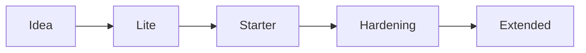

# Vibe Coding Protocols

[Русская версия](./README_ru.md)

### Project status

[](./CHANGELOG.md)
[](https://anmalishev.ru/expert/vibe-coding/)
[](./LICENSE)
[](
  https://github.com/Gudvin82/vibe-coding-protocols/actions/workflows/vibe-check.yml
)

**Not a prompt collection.**

Vibe Coding Protocols is a lightweight configuration and workflow layer for AI-assisted delivery:
routes, Memory Bank files, stop conditions, checks, hardening, incident recovery and release gates.

Repository package: `v0.1.12`  
Web methodology: `Vibe Coding Protocols v1.4`

If you are on mobile, start with:
1. [START_HERE.md](./START_HERE.md)
2. [docs/lite-adoption-path.md](./docs/lite-adoption-path.md)
3. [prompts/use-this-repo-prompt.md](./prompts/use-this-repo-prompt.md)

## What this is

This repository gives you:
- route selection before coding;
- copy-ready AI IDE rules and Memory Bank files;
- Lite, Starter, Hardening and Extended routes;
- lightweight checks such as `vibe-check`;
- synthetic examples, checklists and handoff docs.

Not sure where to start? Open [START_HERE.md](./START_HERE.md).



<details>
<summary>Why this is different from a prompt collection</summary>

| Typical prompt collection | VCP |
|---|---|
| Prompts only | Prompts + templates + checks |
| IDE-specific | AI IDE compatible |
| No hardening path | Lite -> Starter -> Hardening -> Extended |
| No validation | `vibe-check` + CI examples |
| No handoff | `AUDIT_BACKLOG` + Architecture SoT |

</details>

## Start here

| Situation | Start here |
|---|---|
| Only an idea | [English Product Brief prompt](./prompts/product-brief-prompt_en.md) |
| New AI-assisted project | [Starter Protocol](./protocols/ai-project-starter-protocol.md) |
| Existing AI-generated code | [Hardening Protocol](./protocols/ai-project-hardening-protocol.md) |
| Public, client-facing or production-bound | [Extended Protocol](./protocols/ai-project-extended-protocol.md) |
| AI IDE setup | [START_HERE.md](./START_HERE.md) |

## If you only copy one thing

### Solo / MVP

1. Copy `templates/AGENTS.md` as `AGENTS.md`.
2. Copy `templates/PROJECT_MAP.md`.
3. Use `prompts/product-brief-prompt_en.md`.
4. Run `bash scripts/vibe-check.sh --starter`.

<details>
<summary>Small team and production additions</summary>

### Small team

Add:
- `templates/AUDIT_BACKLOG.md`
- `templates/ARCHITECTURE_SOURCE_OF_TRUTH.md`
- CI with `bash scripts/vibe-check.sh --audit`

### Production / client-facing

Add:
- `templates/SECURITY_BASELINE.md`
- `templates/SECURITY_OPERATIONS_BASELINE.md`
- `templates/THIRD_PARTY_REGISTRY.md`
- `templates/INCIDENT_RECOVERY_RUNBOOK.md`
- `templates/METRICS_BOARD.md`

</details>

## Review-first install

```bash
curl -fsSL https://raw.githubusercontent.com/Gudvin82/vibe-coding-protocols/main/scripts/init-minimal.sh -o init-minimal.sh
curl -fsSL https://raw.githubusercontent.com/Gudvin82/vibe-coding-protocols/main/SHA256SUMS -o SHA256SUMS

grep "scripts/init-minimal.sh" SHA256SUMS > init-minimal.sha256
sha256sum -c init-minimal.sha256

less init-minimal.sh
bash init-minimal.sh --starter
```

For macOS:

```bash
shasum -a 256 init-minimal.sh
```

Fast track remains available only for empty or test repositories.
Do not use pipe-to-bash for production projects.

```bash
curl -fsSL https://raw.githubusercontent.com/Gudvin82/vibe-coding-protocols/main/scripts/init-minimal.sh | bash -s -- --starter
```

Optional local guardrail:

```bash
bash scripts/install-hooks.sh --mode starter
```

## Which agent file should I use?

- Root `AGENTS.md` configures this repository.
- Root `CLAUDE.md` configures Claude Code for this repository.
- Do not copy root `AGENTS.md` blindly into your project.
- For your own project, copy `templates/AGENTS.md` as `AGENTS.md`.
- For Claude Code, use `templates/AGENTS.claude.md` or adapt it into your project's `CLAUDE.md`.
- For Cursor or Windsurf, use `templates/AGENTS.cursor.md` or `templates/AGENTS.windsurf.md`.

Core memory files used across the toolkit:
- `README.md`
- `AGENTS.md` or `CLAUDE.md`
- `PROJECT_MAP.md`
- `ARCHITECTURE_SOURCE_OF_TRUTH.md`, if needed
- `AUDIT_BACKLOG.md`, for hardening
- `docs/PROMPTS.md` or `PROMPTS.md`, if prompts are tracked
- `SECURITY.md` or `SECURITY_BASELINE.md`, for public or production projects

## Vibe-check

`vibe-check` is a lightweight readiness signal.
It is not a security scanner and not a security certification.

```bash
bash scripts/vibe-check.sh --help
bash scripts/vibe-check.sh --starter
bash scripts/vibe-check.sh --hardening
bash scripts/vibe-check.sh --audit
bash scripts/vibe-check.sh --audit --json
```

### CI / release check

Use this when the result should matter:

```bash
bash scripts/vibe-check.sh --audit
```

For stricter behavior:

```bash
bash scripts/vibe-check.sh --audit --strict
```

### Local scanner exploration

Optional scanners may be missing on your machine.
Use this only when you want to see optional scanner availability:

```bash
bash scripts/vibe-check.sh --audit --scanners
```

If you intentionally do not want missing optional scanners to stop a local shell session,
you may run:

```bash
bash scripts/vibe-check.sh --audit --scanners || true
```

Do not use `|| true` in CI or release gates.

See:
- [docs/vibe-check-scoring.md](./docs/vibe-check-scoring.md)
- [docs/automated-vibe-check.md](./docs/automated-vibe-check.md)
- [docs/scanner-integration.md](./docs/scanner-integration.md)

## Routes

- [docs/lite-adoption-path.md](./docs/lite-adoption-path.md) — solo builder or MVP route
- [protocols/ai-project-starter-protocol.md](./protocols/ai-project-starter-protocol.md) — new AI-assisted project
- [protocols/ai-project-hardening-protocol.md](./protocols/ai-project-hardening-protocol.md) — existing AI-generated code
- [protocols/ai-project-extended-protocol.md](./protocols/ai-project-extended-protocol.md) — public, client-facing or production-bound project

## Examples

Examples are synthetic or sanitized learning examples.
They are not claimed as real-world case studies.

- [examples/README.md](./examples/README.md)
- [templates/examples/AUDIT_BACKLOG.filled.example.md](./templates/examples/AUDIT_BACKLOG.filled.example.md)
- [templates/examples/THIRD_PARTY_REGISTRY.filled.example.md](./templates/examples/THIRD_PARTY_REGISTRY.filled.example.md)
- [templates/examples/SECURITY_OPERATIONS_BASELINE.filled.example.md](./templates/examples/SECURITY_OPERATIONS_BASELINE.filled.example.md)

## Docs

Start here when you need more depth:
- [docs/README.md](./docs/README.md)
- [docs/one-pager.md](./docs/one-pager.md)
- [docs/faq.md](./docs/faq.md)
- [docs/troubleshooting.md](./docs/troubleshooting.md)
- [docs/comparison.md](./docs/comparison.md)
- [docs/versioning.md](./docs/versioning.md)
- [docs/ide-rules-dry-policy.md](./docs/ide-rules-dry-policy.md)
- [docs/artifact-versioning.md](./docs/artifact-versioning.md)
- [protocols/README.md](./protocols/README.md)
- [checklists/README.md](./checklists/README.md)

## Author

Created by **Anatoly Malyshev**.

Website: [https://anmalishev.ru/](https://anmalishev.ru/)

Hub:
- [https://anmalishev.ru/expert/vibe-coding/](https://anmalishev.ru/expert/vibe-coding/)
- [https://anmalishev.ru/expert/vibe-coding-starter.html](https://anmalishev.ru/expert/vibe-coding-starter.html)
- [https://anmalishev.ru/expert/ai-project-hardening.html](https://anmalishev.ru/expert/ai-project-hardening.html)

## License

The repository is primarily published under `CC BY 4.0`.

Standalone executable scripts in [scripts/](./scripts/) are licensed separately under `MIT`.
