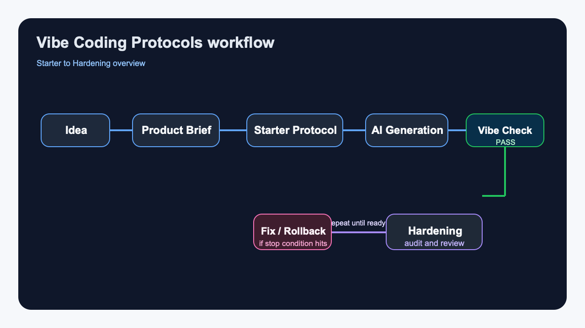
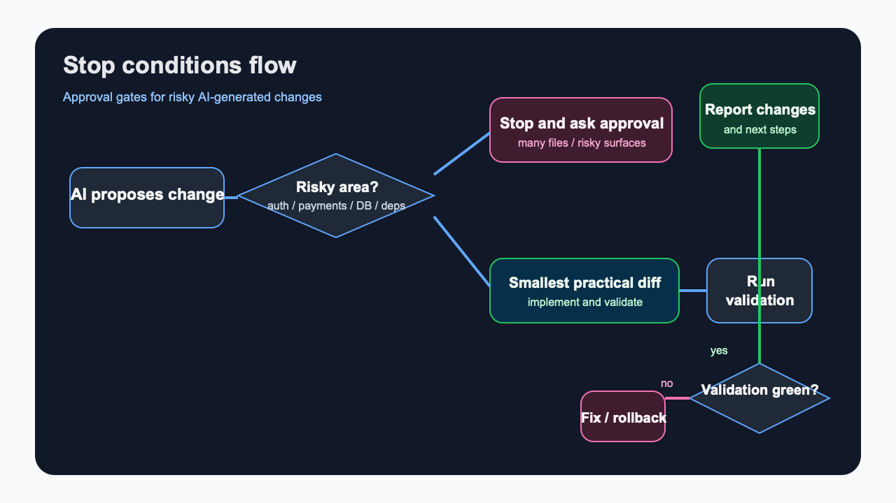
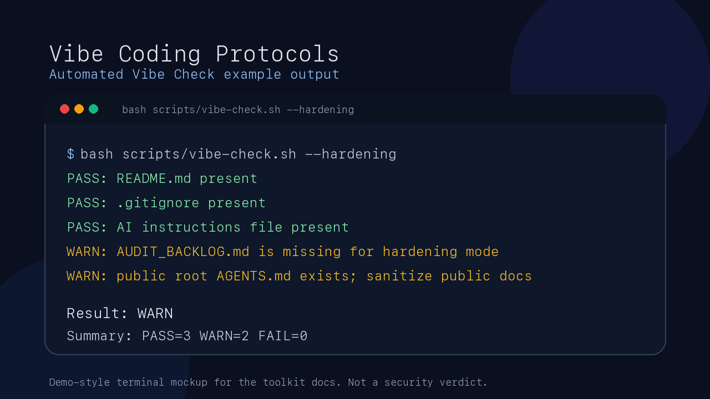

# Vibe Coding Protocols — English entry point

**An operating layer for AI-assisted delivery — not just a prompt collection.**

Practical protocols, prompts, checklists and markdown templates for safer AI-assisted / vibe coding projects.

Vibe Coding Protocols helps founders, solo builders and teams turn AI-assisted coding into a controlled delivery workflow: Product Brief, Memory Bank, AI IDE rules, Starter, Hardening, vibe-check, security operations and audit backlog.

Repository package: `v0.1.5`  
Web methodology: `Vibe Coding Protocols v1.4`

Decision wizard: [START_HERE.md](./START_HERE.md)

## Start here

| I have... | Start here | Copy first | Run |
|---|---|---|---|
| Only an idea | Product Brief | `prompts/product-brief-prompt.md` | — |
| New AI project | Starter Protocol | `AGENTS.md` + `templates/PROJECT_MAP.md` | `bash scripts/vibe-check.sh --starter` |
| Existing AI-generated code | Hardening Protocol | `templates/AUDIT_BACKLOG.md` | `bash scripts/vibe-check.sh --hardening` |
| Public / production project | Extended path | `SECURITY_OPERATIONS_BASELINE.md` + perimeter checklist | `bash scripts/vibe-check.sh --audit` |
| I want AI to apply this repo | AI entry prompt | `prompts/use-this-repo-prompt.md` | — |

## Start in 2 minutes

### New project

1. Copy [AGENTS.md](./AGENTS.md) into your repo.
2. Copy [templates/PROJECT_MAP.md](./templates/PROJECT_MAP.md) as `PROJECT_MAP.md`.
3. Open [prompts/product-brief-prompt.md](./prompts/product-brief-prompt.md).
4. Paste the Product Brief prompt into your AI IDE.
5. Run:

```bash
bash scripts/vibe-check.sh --starter
```

### Existing AI-generated project

1. Copy [templates/AUDIT_BACKLOG.md](./templates/AUDIT_BACKLOG.md).
2. Open [protocols/ai-project-hardening-protocol.md](./protocols/ai-project-hardening-protocol.md).
3. Run:

```bash
bash scripts/vibe-check.sh --hardening
```

### Review-first minimal setup

```bash
curl -fsSL https://raw.githubusercontent.com/Gudvin82/vibe-coding-protocols/main/scripts/init-minimal.sh -o init-minimal.sh
less init-minimal.sh
bash init-minimal.sh --starter
```

Fast track for empty repositories. Review-first flow above is recommended.

```bash
curl -fsSL https://raw.githubusercontent.com/Gudvin82/vibe-coding-protocols/main/scripts/init-minimal.sh | bash -s -- --starter
```

## 10-second overview

1. Start with a Product Brief and Starter Protocol.
2. Use AGENTS rules and Memory Bank files to keep scope under control.
3. Run Hardening before merge, deploy or production.
4. Reuse the templates, checklists, examples and vibe-check in your own repository.

## Why this exists

AI IDEs generate code quickly, but context, architecture, security, dependencies,
validation and ownership often stay in chat history instead of living in the project.

This toolkit adds an operating layer around AI-assisted development:
- Product Brief before code;
- Memory Bank files;
- Starter and Hardening paths;
- self-protection and perimeter checks;
- safe third-party intake;
- token-aware code discovery;
- validation and review gates.

## Core vs Extended

### Core path — for 80% of users

- Product Brief
- AGENTS.md
- PROJECT_MAP.md
- Starter Protocol
- Hardening Protocol
- AUDIT_BACKLOG.md
- vibe-check

### Extended path — for production / teams

- Architecture Source of Truth
- Security Operations Baseline
- Perimeter Security Checklist
- External Exposure Checklist
- Third-Party Registry
- Safe Update Workflow
- Secret Rotation and Storage
- Independent Diff Review

## Security layers covered

- Internal project security
- Perimeter and public exposure
- Supply-chain and integration review
- Architecture and documentation safety
- Token-aware AI workflow

See also:
- [checklists/perimeter-security-checklist.md](./checklists/perimeter-security-checklist.md)
- [templates/SECURITY_OPERATIONS_BASELINE.md](./templates/SECURITY_OPERATIONS_BASELINE.md)
- [docs/token-aware-code-discovery.md](./docs/token-aware-code-discovery.md)

## Artifact map

| Artifact | Purpose | Required? | Use when |
|---|---|---|---|
| Product Brief | Clarifies what to build before coding | Core | Any new project |
| AGENTS.md | Rules for AI agents | Core | Any AI IDE workflow |
| PROJECT_MAP.md | File map and code context | Core | Any repo with code |
| AUDIT_BACKLOG.md | Findings and follow-up tasks | Core for hardening | Existing AI-generated code |
| ARCHITECTURE_SOURCE_OF_TRUTH.md | Architecture reference | Extended | Production, team, handoff |
| SECURITY_OPERATIONS_BASELINE.md | Recurring security checks | Extended | Public/production projects |
| THIRD_PARTY_REGISTRY.md | External packages/APIs/repos | Extended | Any integrations |
| vibe-check.sh | Lightweight structure check | Optional but recommended | Local/CI sanity check |

## Give this repository to your AI

Use [prompts/use-this-repo-prompt.md](./prompts/use-this-repo-prompt.md)
when you want to hand this repository to an AI IDE before any coding starts.

## Paste this into your AI IDE

```text
Study this repository:
https://github.com/Gudvin82/vibe-coding-protocols

Do not write code yet.

First tell me:
1. Which route fits my project: Starter, Hardening, Templates, Architecture Source of Truth, or Security Operations?
2. Which files I should copy first.
3. Which questions are missing.
4. Which risks I may be underestimating.
5. What is the smallest safe next step?

If you cannot open GitHub links, ask me to paste README.md and prompts/use-this-repo-prompt.md.
```

## Why are there AI IDE files in the root?

Root files are intentionally copy-ready entrypoints for AI IDEs:

- `AGENTS.md`
- `CLAUDE.md`
- `.cursorrules`
- `.windsurfrules`
- `.github/copilot-instructions.md`

They are meant to be copied into your own repository or used as examples for AI-assisted delivery rules.

## What not to do first

- Do not paste the whole repository into an AI chat.
- Do not run the installer without reviewing it.
- Do not treat `vibe-check` as a security scanner.
- Do not expose real architecture docs, secrets or internal endpoints publicly.
- Do not let AI rewrite many layers without approval.

## CI/CD integration

This repository includes a lightweight GitHub Action for `vibe-check`.

It runs on:
- `push`
- `pull_request`

It checks:
- toolkit structure;
- local links;
- placeholder / secrets-like examples;
- starter / hardening / audit mode signals.

It does not replace tests, scanners, pentests or human review.

See:
- [.github/workflows/vibe-check.yml](./.github/workflows/vibe-check.yml)
- [docs/automated-vibe-check.md](./docs/automated-vibe-check.md)

## Mermaid flow previews

Mermaid is kept in the main [README.md](./README.md).

Fallback previews:
- 
- 

## Use with your AI IDE

- Claude Code: start with [CLAUDE.md](./CLAUDE.md)
- Codex: start with [AGENTS.md](./AGENTS.md)
- Cursor: start with [.cursorrules](./.cursorrules)
- Windsurf: start with [.windsurfrules](./.windsurfrules)
- GitHub Copilot / VS Code: use [.github/copilot-instructions.md](./.github/copilot-instructions.md)
- JetBrains / Junie / Antigravity: see [agents/](./agents/)

## Automated Vibe Check

`vibe-check` is a lightweight structure and safety check for projects using the toolkit.
It does not replace tests, scanners, human review or the full Hardening Protocol.

```bash
bash scripts/vibe-check.sh --starter
bash scripts/vibe-check.sh --hardening
bash scripts/vibe-check.sh --audit
bash scripts/vibe-check.sh --audit --strict
bash scripts/vibe-check.sh --audit --scanners || true
bash scripts/init-minimal.sh --dry-run
```

Deeper hardening links:
- [START_HERE.md](./START_HERE.md)
- [docs/hardening-thresholds.md](./docs/hardening-thresholds.md)
- [docs/testing-cookbook.md](./docs/testing-cookbook.md)
- [docs/ai-specific-threat-model.md](./docs/ai-specific-threat-model.md)
- [docs/scanner-integration.md](./docs/scanner-integration.md)



See:
- [docs/automated-vibe-check.md](./docs/automated-vibe-check.md)
- [scripts/vibe-check.sh](./scripts/vibe-check.sh)
- [scripts/init-minimal.sh](./scripts/init-minimal.sh)

## Badges for your project

If you use the toolkit, you can add a badge to your project README:

[](https://github.com/Gudvin82/vibe-coding-protocols)
[](https://github.com/Gudvin82/vibe-coding-protocols)
[](https://github.com/Gudvin82/vibe-coding-protocols)

More badge options:
- [docs/badges.md](./docs/badges.md)

## Who should use this?

- Founders: start with Product Brief + Starter Protocol.
- Solo builders: copy `AGENTS.md` + `PROJECT_MAP.md` and run `vibe-check`.
- Product teams: use Core vs Extended as Definition of Ready / Definition of Done.
- Agencies and client teams: use Architecture Source of Truth + AUDIT_BACKLOG + Security Operations Baseline for handoff.

See the full onboarding in [README.md](./README.md).

## Versioning

This project has two related version lines:

- **Repository package version** (`v0.1.x`) — tracks the GitHub toolkit packaging: README, scripts, examples, CI, installer, docs and release polish.
- **Web methodology version** (`v1.4`) — tracks the public methodology pages at `anmalishev.ru`.

Current state:
- Repository package: `v0.1.5`
- Web methodology: `Vibe Coding Protocols v1.4`

A future repository `v1.0.0` release may be used after external feedback, real adoption signals and a stable toolkit interface.

## Author

Created by **Anatoly Malyshev**.

Website: [https://anmalishev.ru/](https://anmalishev.ru/)

Anatoly Malyshev is an AI solutions and automation practitioner focused on practical AI agents,
CRM/1C/BI integrations, analytics workflows, Telegram bots, mini apps and AI-assisted project hardening.

This toolkit grew out of hands-on work with AI-generated projects: turning vague ideas into Product Briefs,
keeping AI coding sessions scoped, documenting architecture, auditing generated code, and preparing projects for safer merge/deploy decisions.

The goal is practical: help founders, indie hackers, developers and teams use AI IDEs without losing architecture,
security context or delivery control.

Based in Saint Petersburg, working with clients and projects across Russia and remote-first teams.

## Official web version

- Hub: [https://anmalishev.ru/expert/vibe-coding/](https://anmalishev.ru/expert/vibe-coding/)
- Starter: [https://anmalishev.ru/expert/vibe-coding-starter.html](https://anmalishev.ru/expert/vibe-coding-starter.html)
- Hardening: [https://anmalishev.ru/expert/ai-project-hardening.html](https://anmalishev.ru/expert/ai-project-hardening.html)
- Templates: [https://anmalishev.ru/expert/templates/](https://anmalishev.ru/expert/templates/)
- Architecture Source of Truth: [https://anmalishev.ru/expert/templates/architecture-source-of-truth.html](https://anmalishev.ru/expert/templates/architecture-source-of-truth.html)
