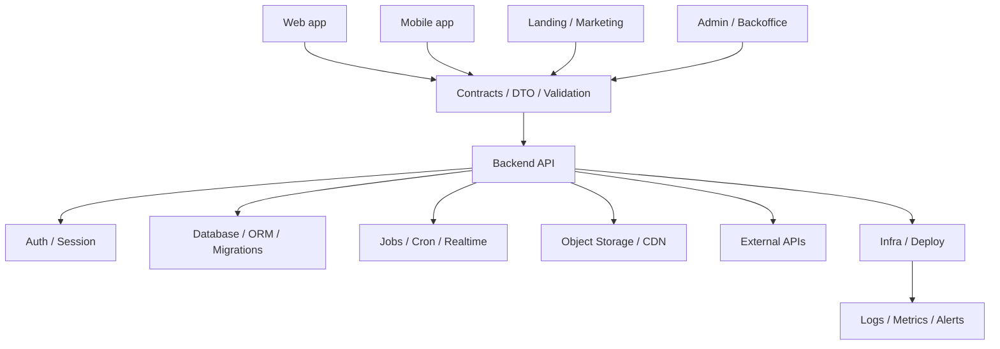

# Architecture Map

Architecture Map is a compact visual planning artifact for AI-assisted projects.

It helps humans and AI understand the project before implementation:

- surfaces;
- contracts;
- backend/API;
- data layer;
- async/realtime;
- integrations;
- infrastructure/deploy;
- active/deferred/not-in-scope boundaries.

It does not replace:
- Architecture Source of Truth;
- PROJECT_MAP;
- security review;
- deployment documentation.

It is a 30-second map before code generation.

## When to use it

Use Architecture Map when:
- starting a new project;
- onboarding an AI agent;
- hardening an existing AI-generated codebase;
- deciding what should be active now and what should be deferred;
- preparing a handoff to a developer or team.

Do not use it as a substitute for real architecture documentation.

## Stack-neutral by default

VCP does not recommend a single default stack.

The map can describe:
- React / Next / Vue / Svelte / Astro;
- FastAPI / Hono / Express / Django / Rails / Laravel;
- PostgreSQL / SQLite / MySQL / MongoDB;
- Redis / queues / cron / workers;
- DigitalOcean / Yandex Cloud / Vercel / Render / Fly / self-hosted;
- any other stack chosen by project constraints.

## Generic Architecture Map

## Surfaces matrix

| Surface | Status | Owner | Notes |
|---|---|---|---|
| Web app | active / deferred / not-in-scope | [FILL IN] | [FILL IN] |
| Mobile app | active / deferred / not-in-scope | [FILL IN] | [FILL IN] |
| Landing | active / deferred / not-in-scope | [FILL IN] | [FILL IN] |
| Admin | active / deferred / not-in-scope | [FILL IN] | [FILL IN] |
| API | active / deferred / not-in-scope | [FILL IN] | [FILL IN] |
| Jobs / cron | active / deferred / not-in-scope | [FILL IN] | [FILL IN] |
| Realtime | active / deferred / not-in-scope | [FILL IN] | [FILL IN] |

## Relationship to other artifacts

Use `ARCHITECTURE_MAP.md` for compact orientation.

Use these files for deeper detail:
- `PROJECT_MAP.md` for entrypoints, routes, modules and operational commands;
- `ARCHITECTURE_SOURCE_OF_TRUTH.md` for detailed decisions, risks and operations;
- `SECURITY_BASELINE.md` for controls and review expectations;
- `THIRD_PARTY_REGISTRY.md` for dependency and service intake.
