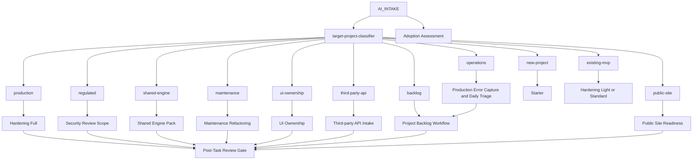

# Route Map

```mermaid
flowchart TD
    A[AI_INTAKE] --> B[target-project-classifier]
    B --> C[new-project]
    B --> D[existing-mvp]
    B --> E[production]
    B --> F[regulated]
    B --> G[shared-engine]
    B --> H[maintenance]
    B --> I[ui-ownership]
    B --> J[third-party-api]
    B --> K[operations]
    B --> L[backlog]
    B --> M[public-site]
    C --> N[Starter]
    D --> O[Hardening Light or Standard]
    E --> P[Hardening Full]
    F --> Q[Security Review Scope]
    G --> R[Shared Engine Pack]
    H --> S[Maintenance Refactoring]
    I --> T[UI Ownership]
    J --> U[Third-party API Intake]
    K --> V[Production Error Capture and Daily Triage]
    L --> W[Project Backlog Workflow]
    M --> X[Public Site Readiness]
    P --> Y[Post-Task Review Gate]
    Q --> Y
    R --> Y
    S --> Y
    T --> Y
    U --> Y
    V --> W
    W --> Y
    X --> Y
    A --> Z[Adoption Assessment]
```
