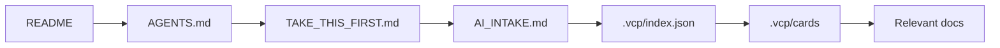
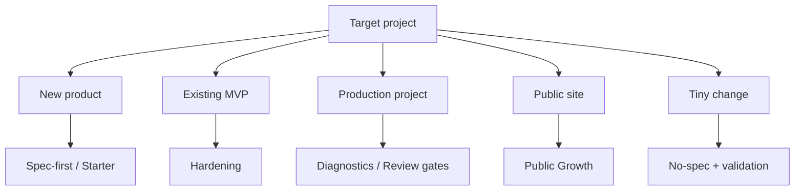
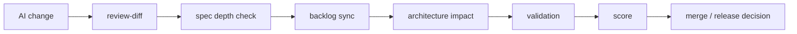

# Visual Overview

Visual overview: `docs/visual-overview.md`

This page gives a fast visual orientation for humans and AI agents without replacing the deeper docs.

## Product delivery lifecycle

## AI agent inspection path

## Adoption decision flow

## Trust gates flow

## How to use this page

- Human first impression: read this page, then `docs/demo.md`.
- AI first inspection: use `AGENTS.md`, `TAKE_THIS_FIRST.md`, then this page if lifecycle context is needed.
- Adoption from link: use the decision flow before copying files.
