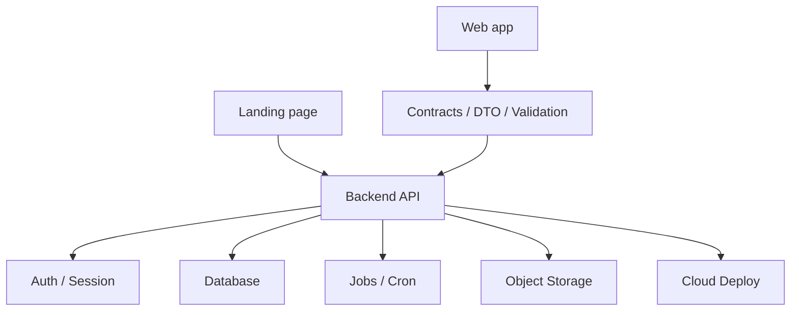

# Architecture Map Example

> Synthetic example — not a recommended default stack.

This example shows how to describe project architecture before asking an AI to generate code.
Use the format, not the exact stack.

## Scenario

A small SaaS MVP with:
- web app;
- landing page;
- backend API;
- database;
- background jobs;
- object storage;
- cloud deploy.

## Map

## Active now

- web app;
- landing page;
- backend API;
- database.

## Deferred

- background jobs beyond one scheduled task;
- mobile app;
- realtime collaboration.

## Not in scope

- marketplace features;
- multi-region deploy;
- enterprise SSO.

## What AI should do first

- refine Product Brief;
- write `ARCHITECTURE_MAP.md`;
- identify active/deferred boundaries;
- document contracts and validation layer;
- propose the smallest safe first implementation slice.

## What AI should not do yet

- add every possible surface;
- choose cloud infrastructure blindly;
- add queues, workers or caching without a clear reason;
- assume a stack is recommended just because it appears in this example.
