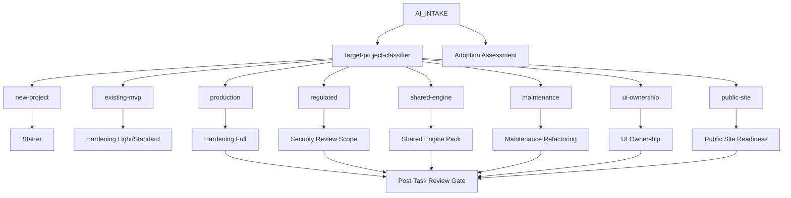

# Route Map

```mermaid
flowchart TD
    A[AI_INTAKE] --> B[target-project-classifier]
    B --> C[new-project]
    B --> D[existing-mvp]
    B --> E[production]
    B --> F[regulated]
    B --> G[shared-engine]
    B --> H[maintenance]
    B --> I[ui-ownership]
    B --> J[public-site]
    C --> K[Starter]
    D --> L[Hardening Light/Standard]
    E --> M[Hardening Full]
    F --> N[Security Review Scope]
    G --> O[Shared Engine Pack]
    H --> P[Maintenance Refactoring]
    I --> Q[UI Ownership]
    J --> R[Public Site Readiness]
    M --> S[Post-Task Review Gate]
    N --> S
    O --> S
    P --> S
    Q --> S
    R --> S
    A --> T[Adoption Assessment]
```
