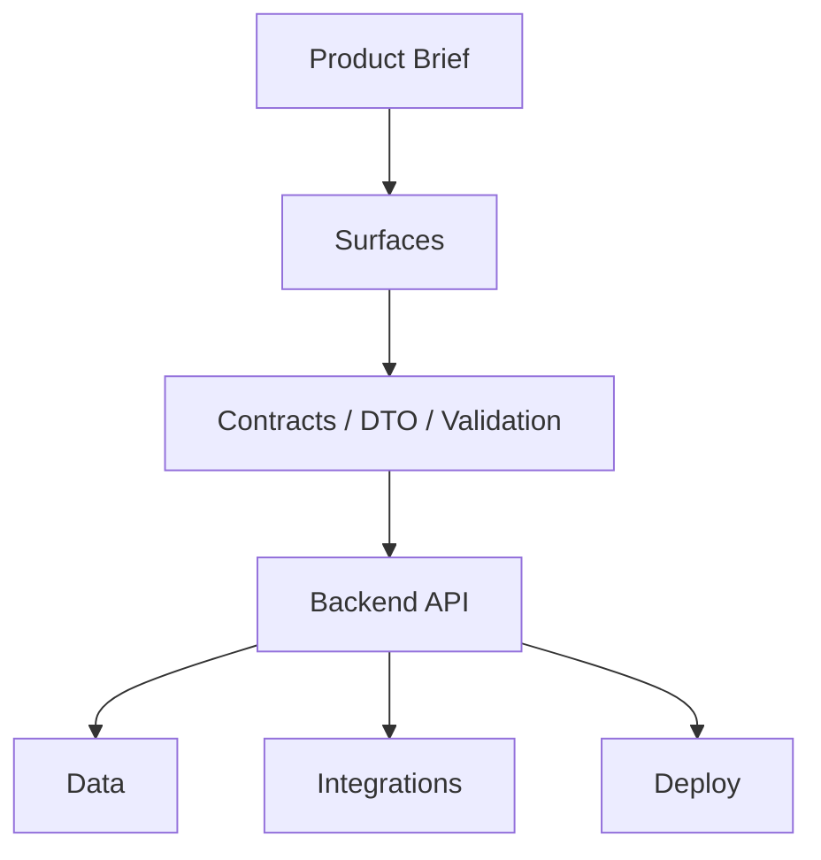

<!-- vcp-version: v0.8.6 -->
<!-- methodology-version: v1.4 -->
<!-- vcp-version: v0.8.4 -->

<!-- vcp-version: v0.8.2 -->

# Architecture Map

<!-- vcp-artifact: ARCHITECTURE_MAP -->
<!-- vcp-version: v0.8.2 -->

Use this file to give humans and AI a compact project map before implementation.

This is not a full architecture document.
For production or client-facing projects, also use:
- `ARCHITECTURE_SOURCE_OF_TRUTH.md`
- `PROJECT_MAP.md`
- `SECURITY_BASELINE.md`
- `THIRD_PARTY_REGISTRY.md`

## Project type

- [FILL IN]

## Active surfaces

- [FILL IN]

## Deferred surfaces

- [FILL IN]

## Not in scope

- [FILL IN]

## Architecture map

## Stack decisions

| Layer | Decision | Why | Alternative considered |
|---|---|---|---|
| Web | [FILL IN] | [FILL IN] | [FILL IN] |
| Backend | [FILL IN] | [FILL IN] | [FILL IN] |
| Database | [FILL IN] | [FILL IN] | [FILL IN] |
| Deploy | [FILL IN] | [FILL IN] | [FILL IN] |

## AI implementation boundary

The AI may implement:
- [FILL IN]

The AI must not implement yet:
- [FILL IN]

## Open questions

- [FILL IN]
